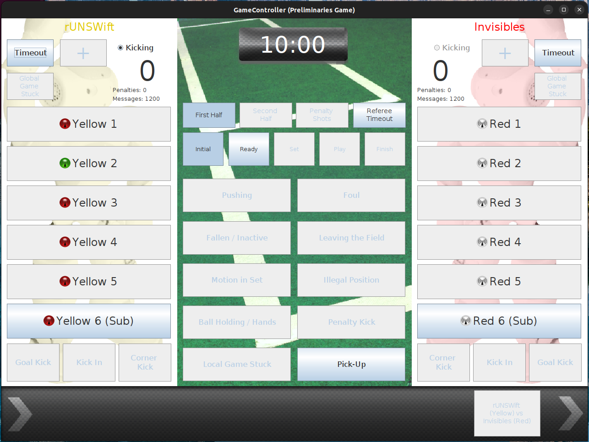

Tutorial
########

First, you should run the game_controller_spl node that handles communication with the SPL GameController.
You must provide the versions of the GameController data and return data that you want to use as parameters.

.. code-block:: sh

   ros2 run game_controller_spl game_controller_spl --ros-args -p rcgcd_version:=16 -p rcgcrd_version:=4

.. note::

   Change the rcgcd version and rcgcrd version to match your GameController

List the topics:

.. code-block:: sh

   ros2 topic list -t

You should see the following amongst the listed topics:

.. code-block:: sh

   /gc/data [game_controller_spl_interfaces/msg/RCGCD16]
   /gc/return_data [game_controller_spl_interfaces/msg/RCGCRD4]

Echoing data from GameController
================================

To access GameController data from within your own node, simply subscribe to the ``/gc/data`` topic.

The game_controller_spl node receives UDP packets from the GameController, converts them to ROS msgs and publishes them as ROS topics.
``/gc/data`` is the topic that it publishes to.

Bring up a GameController instance, following instructions in the `GameController`_ README:

.. image:: images/GameController.png
   :align: center

Use the following command to echo the ``/gc/data`` topic:

.. code-block:: sh

   ros2 topic echo /gc/data

You should see the data from the GameController being echoed similar to the following:

.. code-block:: sh

   packet_number: 202
   players_per_team: 6
   competition_phase: 0
   competition_type: 0
   game_phase: 0
   state: 2
   set_play: 0
   first_half: 1
   kicking_team: 5
   secs_remaining: 600
   secondary_time: 0
   teams:
   - team_number: 5
   field_player_colour: 3
   goalkeeper_colour: 3
   goalkeeper: 1
   team_colour: 0
   score: 0
   penalty_shot: 0
   single_shots: 0
   message_budget: 1200
   players:
   - penalty: 0
      secs_till_unpenalised: 0
   .......
   - team_number: 0
   field_player_colour: 0
   goalkeeper_colour: 0
   goalkeeper: 1
   team_colour: 0
   score: 0
   penalty_shot: 0
   single_shots: 0
   message_budget: 1200
   players:
   - penalty: 0
      secs_till_unpenalised: 0
   .......

Sending data to GameController
==============================

To send data from within your own node, simply publish to the ``/gc/return_data`` topic.

The game_controller_spl node listens on the ``/gc/return_data`` topic, converts them to UDP packets and sends them to the GameController.

Bring up a GameController instance with one team set to team 18 (rUNSWift), following instructions in the `GameController`_ README:

.. image:: images/GameController.png
   :align: center

Use the following command to publish a msg to the topic:

.. code-block:: bash

   ros2 topic pub --once /gc/return_data game_controller_spl_interfaces/msg/RCGCRD4 "{player_num: 2, team_num: 18}"

You can see that the GameController is reporting a green light for team rUNSWift's player 2, indicating a message has been received recently.

.. _GameController: https://github.com/RoboCup-SPL/GameController
